# BBQ with friends

View the live website here. [link](https://bbq-with-friends.herokuapp.com/)

This is a website for finding, making, sharing and storing BBQ recipes. 
On top of that the site gives users the ability to send messages to each other, 
store favourite recipes and search for recipes. 

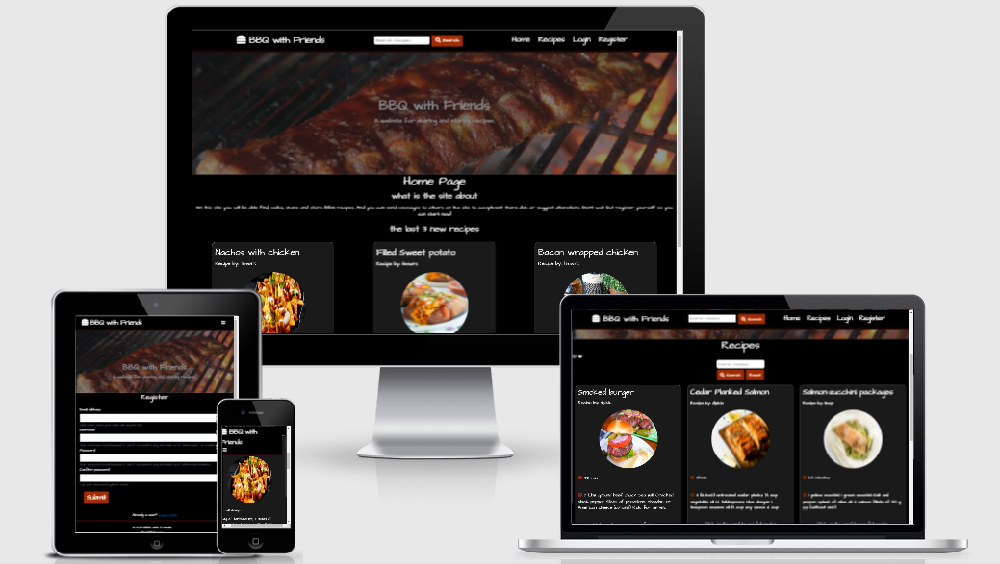

## User Experience (UX)

-   ## User stories

    -   #### First Time Visitor Goals

        1. As a First Time Visitor, I would like to see what the site is about and how the site works. 
           The expected first time visitors would be people  just looking for a good recipe. 
        2. As a First Time Visitor, I want to find a good recipe.
        3. As a First Time Visitor, i want to be able to easily navigate the site.

    -   #### Returning Visitor Goals

        1. As a Returning Visitor, I want to make and store recipes.
        2. As a Returning Visitor, I want to be able to edit and or delete my stored recipes.

    -   #### Frequent User Goals
        1. As a Frequent User, I want to communicated with other users about recipes.
            the expected frequent Users  would be people wanting to part of the culture of the website
        2. As a Frequent User, I want to see the latest recipes added.
        3. As a Frequent User, I want to be able to make a list of favourite recipes.

    ## Design
    -   ### Colour Scheme
        Within this website only 3 colors were used. black, white and a dark tone of orange. black was used as the background to give the site a polished and stylish look. on top of that the black gives association with the bbq with coals. white was used for the text because this matches well with the black and makes it easy to read. Orange was used to direct the users attention to the interactive parts of the site. this was chosen because it gives the association with the fire of a BBQ, also when using mainly white and black any color pops up more on a site and draws attention.

        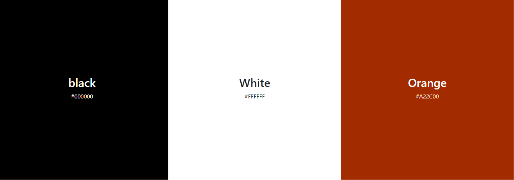

        The color test - [View](static/pdf/color-samples.pdf)

    -   ### Typography
        The font used is Architects Daughter this is a informal yet easy to read font. This styles well with the main theme of the site: BBQ.
        as back-up in the case Architects Daughter fails there is sans-serif.  

        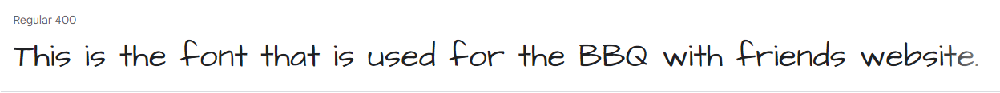

    -    ### Imagery
            A hero image is used on every page. 

    -   ### Wireframes

        - Wireframe for BBQ with Friends - [View](static/pdf/wireframes.pdf)

## Features

- ### General

    - The navigation bar is responsive for mobile phone users it shows a hamburger menu with all the same links as the big nav-bar. The buttons are interactive for the computer users when hovered over they give conformation by a small orange line beneath them.
    - for computer users you can see a searchfield in the navbar so no matter what page they are on the can search for recipes, catogories, ingredients. this redirects to the recipe page.   
    - On every page you can see the hero image underneath the navbar. this has a zoomfunction to capture the attention of the users when they arrive on the pages.
    - all the pages have a message box that displays text when a important action was succesfull or when an error occurred.  

    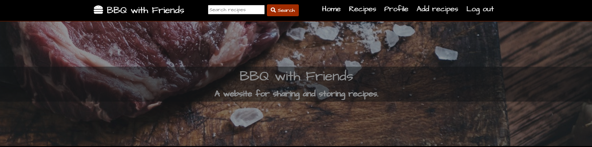

- ### Home
    - The Home (index) screen shows a small explanation what the site is about to make sure that new users know what the site is about. beneath that the 3 newest recipe's will be displayed so that returning and frequent users can instantly see if there are any new recipes.

    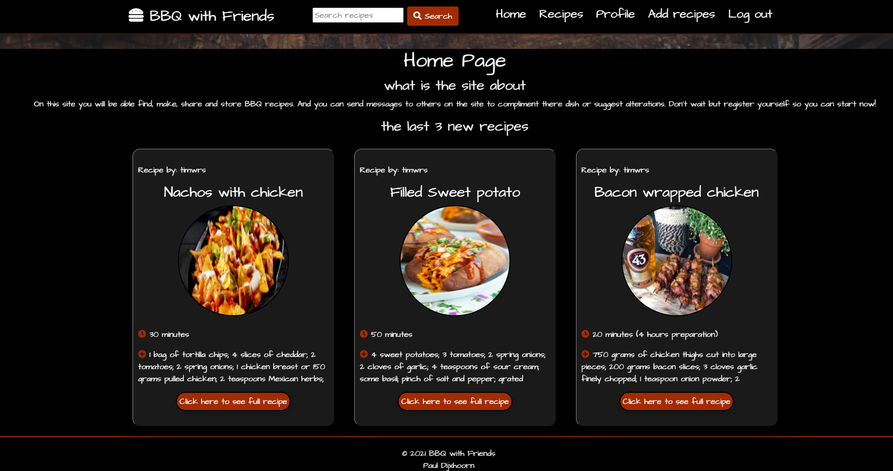

- ### Recipes
    - On the recipe page all the recipes are displayed in small stylish cards. these cards are small so you can see more recipes at the same time. when clicked they redirect the user to a page where this recipe is displayed in full.

    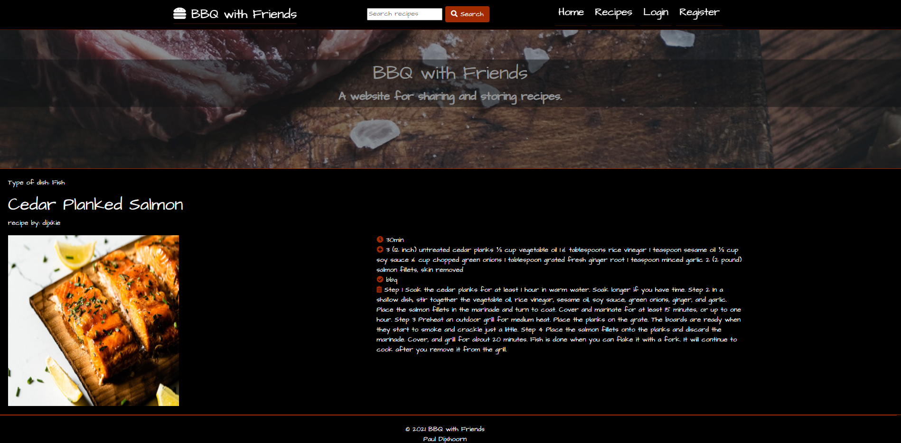

    - Above the recipes there is a search field and two buttons. The search button will search the database for recipes with the content of the search field when clicked. search parameters include. recipe name, ingredients, explanation and created by user. the reset button returns all the recipes.
    - When logged in as a user you can see a icon on the right upper corner this toggles the recipe to the  favourites these recipes are displayed on the profile page.

    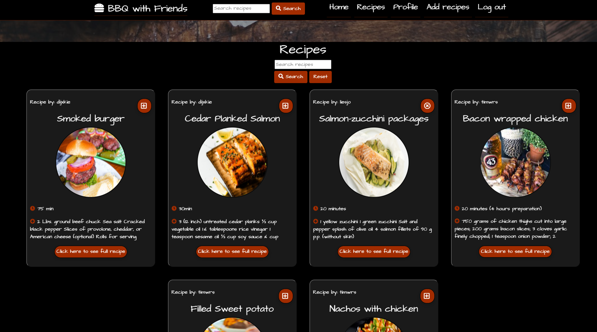
        
- ### Profile
    - on the top of the profile page you can find a messaging system. this gives users the oppertunity to send messages to other users. messages can be deleted with a small delete button. 

    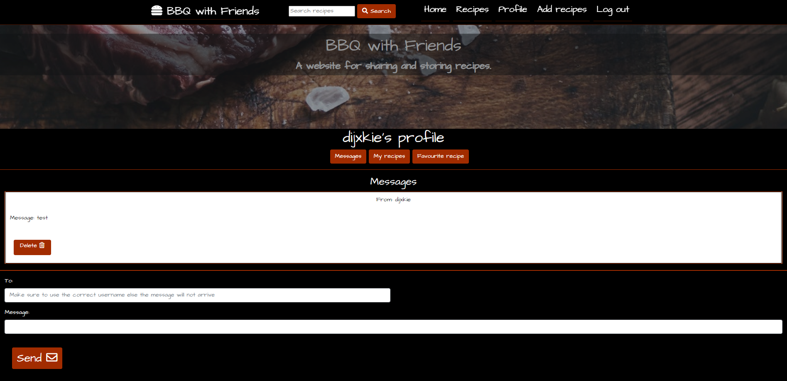

    - beneath the messages a user can see all the recipes that he/ she created. these recipes can be edited by clicking the edit button this will redirect to a new page were you can edit the recipe after submitting you will be redirected back. these recipes can be deleted aswell by clicking the delete button.

    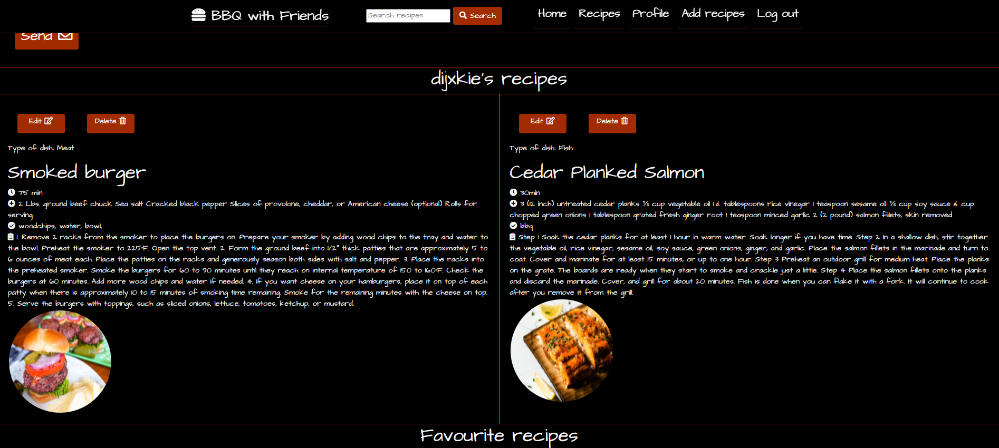

    - Underneath the personal recipes there is a favourites list here you can find all tyhe recipes that are marked on the recipe page. each one has a button to remove it from the list again.

    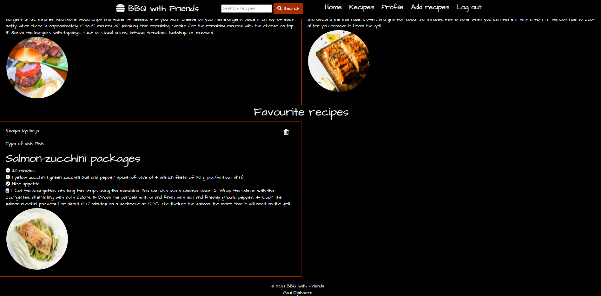    

- ### Login / Register 
    - on the login page you can find the form to login when you submit the form and the password and username are correct you will be redirected to the profile page the page with the main content for loged in users. this page contains a link to the register page for visitors that do not yet have a account.

    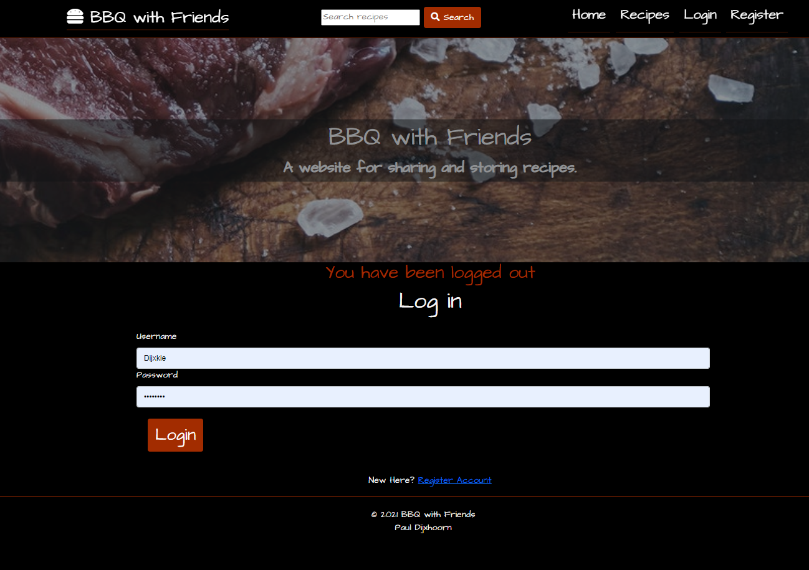  

    - the register page has a form to register a account. this form has a check for double usernames and email adresses and has a password cconformation to make sure that users really have the password the want. this page has a link to the login page for visitors that already have a account.

    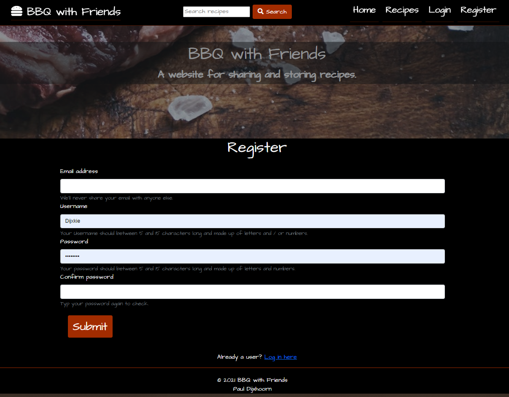  

- ### Add recipes
    - As a user when logged in you can add recipes by clicking the add recipe button on the navbar. Here you find a form to fill in all the data of the recipe.

    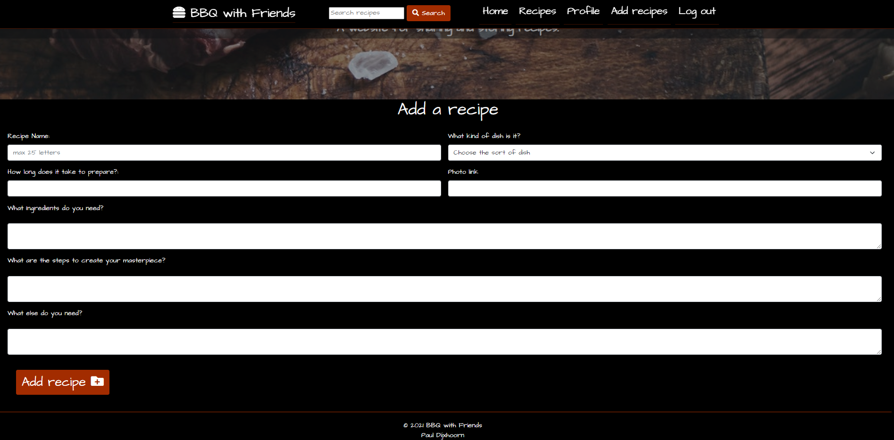  

- ### Future features
    - The users will be able to add more information about them self and see other users.
    - A forum or message board to have group disscusions and conversations so that a community can form 
    - Password recovery 
    - Registration conformation with email
    - On the profile page in the messages. messages send will be seen aswell and will be displayed more like a conversation (like whatsapp). 
        

## Technologies Used

- ### Languages Used

    - [HTML5](https://en.wikipedia.org/wiki/HTML5)
    - [CSS3](https://en.wikipedia.org/wiki/Cascading_Style_Sheets)
    - [Javascript](https://en.wikipedia.org/wiki/JavaScript)
    - [python](https://en.wikipedia.org/wiki/Python_(programming_language))

- ### Frameworks, Libraries & Programs Used
    1. [Heroku](https://id.heroku.com/login)
    2. [Db mongo](https://www.mongodb.com/cloud/atlas?utm_content=rlsapostreg&utm_source=google&utm_campaign=gs_emea_rlsamulti_search_brand_dsa_atlas_desktop_rlsa_postreg&utm_term=&utm_medium=cpc_paid_search&utm_ad=b&utm_ad_campaign_id=14412646473&gclid=CjwKCAjwmqKJBhAWEiwAMvGt6B8h7cHntKHOhaSJ3kJQJ_LnOk1EI7Wp-jgH5lQhb4KojXM_XWzilhoCQFYQAvD_BwE) 
    3. [Bootstrap](https://getbootstrap.com/) to make the website more responsive and to simplify the code.
    4. [Tilt](https://micku7zu.github.io/vanilla-tilt.js/) to get the recipe card tilt effect
    5. [Font awesome](https://fontawesome.com/) Tto provide icons to the website.
    6. [Google fonts](https://fonts.google.com/) to style the website fonts.

## Testing

the

[W3C Markup Validator](https://validator.w3.org/)
all pages were checked using the W3C markup validator. most pages were checked via url however 
some you have to be logged in so these sites were checked by copying the code into the validator.
none of the pages displayed errors. 

[W3C CSS Validator](https://jigsaw.w3.org/css-validator/#validate_by_input)
The CSS was checked by direct input. no mistakes were found. 
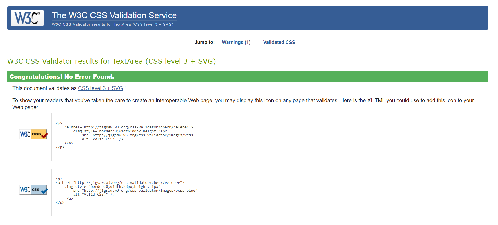

[jshint javascript validator](https://jshint.com/)

### Testing User Stories from User Experience (UX) Section

-   #### First Time Visitor Goals
    1. As a First Time Visitor, I would like to see what the site is about and how the site works. 
        The expected first time visitors would be people  just looking for a good recipe. 
    2. As a First Time Visitor, I want to find a good recipe.
    3. As a First Time Visitor, i want to be able to easily navigate the site.

-   #### Returning Visitor Goals
    1. As a Returning Visitor, I want to make and store recipes.
    2. As a Returning Visitor, I want to be able to edit and or delete my stored recipes.

-   #### Frequent User Goals
    1.As a Frequent User, I want to communicated with other users about recipes.
            the expected frequent Users  would be people wanting to part of the culture of the website
    2. As a Frequent User, I want to see the latest recipes added.
    3. As a Frequent User, I want to be able to make a list of favourite recipes.

### Further Testing

- The website was tested on Google Chrome and on Edge. 
- The website was tested with all the pages for the responsiveness on phone ipad and computer and also on devtools in chrome for the same thing.
- The website was tested by several people on different devices to see if the links and functions were working.

### know bugs

- The intention was to use a full heart and empty heart icon for the favourite function beacuse these are well know ti users and there for automatic and UX friendly. however these icons are always displaying empty hearts. this has something to do with the before after states within CSS. when i tried to trace them by inspecting them the source seemed to come from the fontawesome styled sheets. therefor other icons are used for this function at the moment. *issue fixed*
- When deleting a favourite recipe from the profile page you get redirected to recipe page instead back to the profile page.

## Deployment

to run this project on your own IDE you can follow the instructions below:

### instructions

1. Make a clone of the github repository [link](https://github.com/pjdijxhoorn/Milestone-project-3). 
If your IDE has a clone function you can use the url provided after clicking code. Else download the zip file and extract this to your chosen folder. alternatif if you have Git installed you can clone the repository with the following command.

        git clone https://https://github.com/pjdijxhoorn/Milestone-project-3

2. openm your IDE, open a terminal un the unzip folder or cd the correct location.

3. A
### GitHub Pages

### Forking the GitHub Repository

### Making a Local Clone

## Credits

## Code

### Content 

- Content created by the users: admin and dijxkie is created by the site creator.
- All the other recipes are created by the other users of the site this includes the images used there. 

### images
    - The hero image was taken from https://www.rawpixel.com/image/414964/cooking-slice-steak 
    it was a free photo made by rob (no other name was given).

### Acknowledgements

     - Thanks to my great friends and family for populating the website with users and original recipes.
     - Special thanks to my mentor for being so inspirational and helpfull.

## Contact

feel free to contact me at pjdijxhoorn(at)hotmail(dot)com
