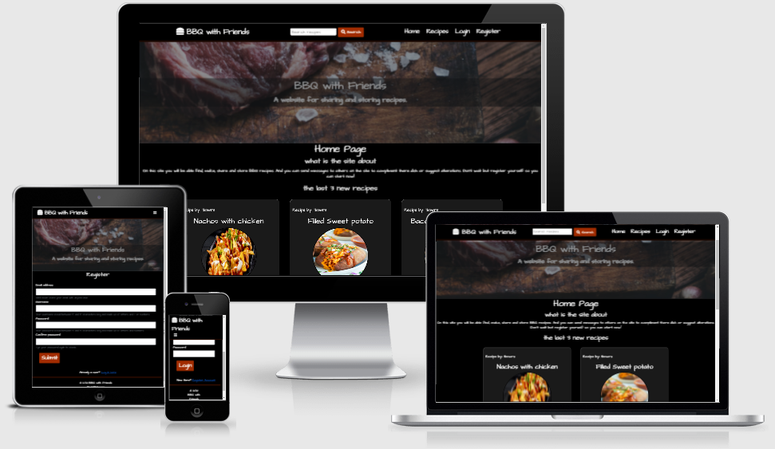

# BBQ with friends

View the live website here. [link](https://bbq-with-friends.herokuapp.com/)

This is a website for finding, making, sharing and storing BBQ recipes. 
On top of that the site gives users the ability to interact with each other by sending messages to each other. 
to make it easier to find back those great recipes  you can store your favourite recipes.
the website is designed to work on phone tablet and pc. The website isn't designed with a particuliar device in mind. However searching and storing is most handy on pc because you can oversee all the recipes better.
when you are BBQ-ing you don't want to drag a pc around because of this the website is made in a way so you can see the recipes in full screen on tablet and phone.



## Table of contents
1. [UX](#UX)
2. [Features](#Features)
3. [Information Architecture](#Information)
4. [Technologies Used](#Technologies)
5. [Testing](#Testing)
6. [Deployment](#Deployment)
7. [Credits](#Credits)
8. [contact](#Contact)


## User Experience (UX)

- ## main aims
    - to create a website that gives people a platform to share their recipes and form a community of BBQ lovers.
    - give people a place where the can store and find new bbq recipes.

-   ## User stories

    -   #### First Time Visitor Goals

        1. As a First Time Visitor, I would like to see what the site is about and how the site works. 
           The expected first time visitors would be people  just looking for a good recipe. 
        2. As a First Time Visitor, I want to find a good recipe.
        3. As a First Time Visitor, I want to be able to easily navigate the site.

    -   #### Returning Visitor Goals

        1. As a Returning Visitor, I want to make and store recipes.
        2. As a Returning Visitor, I want to be able to edit and or delete my stored recipes.

    -   #### Frequent User Goals
        1. As a Frequent User, I want to communicated with other users about recipes.
            the expected frequent Users  would be people wanting to part of the culture of the website
        2. As a Frequent User, I want to see the latest recipes added.
        3. As a Frequent User, I want to be able to make a list of favourite recipes.

    ## Design
    -   ### Colour Scheme
        Within this website only 3 colors were used. black, white and a dark tone of orange. black was used as the background to give the site a polished and stylish look. on top of that the black gives association with the bbq with coals. white was used for the text because this matches well with the black and makes it easy to read. Orange was used to direct the users attention to the interactive parts of the site. this was chosen because it gives the association with the fire of a BBQ, also when using mainly white and black any color pops up more on a site and draws attention.

        

        The color test - [View](static/pdf/color-samples.pdf)

    -   ### Typography
        The font used is Architects Daughter this is a informal yet easy to read font. This styles well with the main theme of the site: BBQ.
        as back-up in the case Architects Daughter fails there is sans-serif.  

        

    -    ### Imagery
            A hero image is used on every page. 


    -   ### Wireframes

        - Wireframe for BBQ with Friends - [View](static/pdf/wireframes.pdf)

## Features

- ### General
    
    - The navigation bar is responsive for mobile phone and ipad users it shows a hamburger menu with all the same links as the big nav-bar. The buttons are interactive for the computer users when hovered over they give conformation by a small orange line beneath them.
    
    
    - for computer users you can see the menu items on the bar and a search field so no matter what page they are on the can search for recipes, catogories, ingredients. this redirects to the recipe page.
    

    - On every page you can see the hero image underneath the navbar. this has a zoom function to capture the attention of the users when they arrive on the pages.
    - all the pages have a message box that displays text when a important action was succesfull or when an error occurred.

      

    


- ### Home
    - The Home (index) screen shows a small explanation what the site is about to make sure that new users know what the site is about. beneath that the 3 newest recipes will be displayed so that returning and frequent users can instantly see if there are any new recipes.

    

- ### Recipes
    - On the recipe page all the recipes are displayed in small stylish cards. These cards are small so you can see more recipes at the same time. when clicked they redirect the user to a page where this recipe is displayed in full.

    

    - Above the recipes there is a search field and two buttons. The search button will search the database for recipes with the content of the search field when clicked. Search parameters include. Recipe name, ingredients, explanation and created by user. The reset button returns all the recipes.
    - When logged in as a user you can see an icon on the right upper corner. This icon toggles the recipe to the favourites function. These recipes are displayed on the profile page.

    
        
- ### Profile
    - On the top of the profile page you can find a messaging system. This messaging system gives users the opportunity to send messages to other users. When sending messages  you get a suggestion field for other users in your input field.  This function is build with a datalist. This will be a good option for when the website grows and there are a lot of users. Messages can be deleted with a small delete button, from where you will be directed to a modal were you can confirm to delete. 

    

    - Beneath the messages a user can see all the recipes that he/she created. These recipes can be edited by clicking the edit button. This will redirect to a new page where you can edit the recipe after submitting you will be redirected back. These recipes can be deleted as well by clicking the delete button, which will direct you to a modal here you can confirm the deletion.

    

    - Underneath the personal recipes there is a favourites list here you can find all the recipes that are marked on the recipe page. Each one has a button to remove it from the list again.

        

- ### Login / Register 
    - On the login page you can find the form to login. When you submit the form and the password and username are correct you will be redirected to the profile page, the page with the main content for logged in users. This page contains a link to the register page for visitors that do not yet have a account.

      

    - The register page has a form to register an account. This form has a check for double usernames and email addresses and has a password conformation to make sure that users really have the password they want. This page has a link to the login page for visitors that already have an account.

      

- ### Add recipes
    - As a user when logged in you can add recipes by clicking the add recipe button on the navbar. Here you find a form to fill in all the data of the recipe. Adding photos is done by an URL. In the next block we will learn about how to add photo's in other ways. 

      

- ### Future features
    - The users will be able to add more information about them selfs and see other users;
    - A forum or message board to have group discussions and conversations, so that a community can be formed; 
    - Password recovery; 
    - Registration conformation with email;
    - On the profile page in the messages. Messages send will be seen as well and will be displayed more like a conversation (like WhatsApp);
    - Recipe explanation can be structured into steps, instead of a text area. 
        
## Information Architecture

- ### Database structure
    The data used for this project is stored in my MongoDB database. There are 4 collections within:
    1. *Users* this collection stores the username, encrypted password, email and a array of favourites with a content of stings. 
    2. *Categories* this collection stores the categories of recipes.
    3. *Recipes* this collection stores the recipes: (category, name, preparation-time, photo-URL, ingredients, explanation, other requirements and the person who it is created by).
    4. *Messages* this collection stores who made the messages, who it is for, and the messages itself.

- ### Data Storage Types
    The data types stored in the mongoDB database are:

    1. ObjectId
    2. String
    3. array

- ### Collections Data Structure
    - #### User collection

| Title | Key in db | Form validation type | Data type |
-----  | ---  | --- | ---
users | _id  | None | ObjectId 
Username | username | text, `minlength="5"` | string
Password | password | text, `maxlength="15"`| string
favourites | favourites | array| array
-----  | ---  | --- | ---
0 | 0 | text, an recipe ID`| string

- #### Categories collection 

| Title | Key in db | Form validation type | Data type |
-----  | ---  | --- | ---
categories | _id  | None | ObjectId 
Category_name | category_name | text, | string


- #### Recipes collection

| Title | Key in db | Form validation type | Data type |
-----  | ---  | --- | ---
Recipies | _id  | None | ObjectId 
Category_name | category_name | text, select-dropdown `required` | string
Name_dish | Name_dish | text, `required`| string
Preperation_time | preperation_time | text, `required` | string
Photo_link | Photo_link | text,  url| string
Ingredients | ingredients | text, `required` | string
Explanation | explanation | text, `required`| string
Other_requirments | Other_requirments | text | string
Created_by | created_by | username, automatic | string


- #### Messages collection

| Title | Key in db | Form validation type | Data type |
-----  | ---  | --- | ---
Messages | _id  | None | ObjectId 
Created_by | created_by | text, automatic | string
For | for | text suggestions| string
Messages | messages | text| string


## Technologies Used

- ### Languages Used

    - [HTML5](https://en.wikipedia.org/wiki/HTML5)
    - [CSS3](https://en.wikipedia.org/wiki/Cascading_Style_Sheets)
    - [Javascript](https://en.wikipedia.org/wiki/JavaScript)
    - [python](https://en.wikipedia.org/wiki/Python_(programming_language))

- ### Frameworks, Libraries & Programs Used
    1. [Heroku](https://id.heroku.com/login) was used to host my app.
    2. [Db mongo](https://www.mongodb.com/cloud/atlas?utm_content=rlsapostreg&utm_source=google&utm_campaign=gs_emea_rlsamulti_search_brand_dsa_atlas_desktop_rlsa_postreg&utm_term=&utm_medium=cpc_paid_search&utm_ad=b&utm_ad_campaign_id=14412646473&gclid=CjwKCAjwmqKJBhAWEiwAMvGt6B8h7cHntKHOhaSJ3kJQJ_LnOk1EI7Wp-jgH5lQhb4KojXM_XWzilhoCQFYQAvD_BwE) was used as database storage in the cloud. 
    3. [Bootstrap](https://getbootstrap.com/) to make the website more responsive and to simplify the code.
    4. [Tilt](https://micku7zu.github.io/vanilla-tilt.js/) to get the recipe card tilt effect
    5. [Font awesome](https://fontawesome.com/) Tto provide icons to the website.
    6. [Google fonts](https://fonts.google.com/) to style the website fonts.
    7. [flask](https://flask.palletsprojects.com/en/2.0.x/) was used to help write the python code.
    8. [lucid](https://lucid.app/documents#/dashboard?folder_id=home) was used for the Wire frames
    9. [pymongo](https://pymongo.readthedocs.io/en/stable/) was used as an Python API for MongoDB. This helped me to connect data from back-end to the front-end
    10. [jinja](https://jinja.palletsprojects.com/en/2.11.x/) was used for templating in HTML.


## Testing

The IDE was Gitpod within Gitpod you can install extensions. For this project I used two extensions: Code spell checker to check the spelling of the code, and js-css-html formatter to check indentation. However the code was also tested using The W3C CSS Validator, The W3C Markup Validator, and the JShint validator, to make sure no mistakes errors are left in the project.

### HTML Validation

-   [W3C Markup Validator](https://validator.w3.org/)
All pages were checked using the W3C markup validator. Most pages were checked via URL. However, 
for the profile page you have to be logged in, so this page was checked by copying the code into the validator.
None of the pages displayed errors. One warning was found on all pages for the section for flash messages. However, this section is only shown when errors occur, therefore this needs no heading.
    

### CSS Validation

- [W3C CSS Validator](https://jigsaw.w3.org/css-validator/#validate_by_input)
The CSS was checked by direct input. No mistakes were found. 


### JS Validation

- [jshint javascript validator](https://jshint.com/)
The javascript was tested by direct input. No mistakes were found.


###  Python Validation

- [PEP8 online](http://pep8online.com/checkresult)
The python was checked with PEP8 online. No mistakes were found.


### Testing User Stories from User Experience (UX) Section

-   #### First Time Visitor Goals
    1. As a first time visitor, I would like to see what the site is about and how the site works. The expected first time visitors would be people  just looking for a good recipe. 

        1. On the home page there is a small explanation what the site is about. It is also in de banner in the hero-image. The buttons and nav-bar lead the way for the rest of the functions. These use familiar icons and titles to direct the users to the content.

    2. As a first time visitor, I want to find a good recipe.
        
        2. On the recipe page you can search for recipes. If you want to find something specific else, you can see all the recipes there. accessible for everybody. 

    3. As a first time visitor, I want to be able to easily navigate the site.

        3. To make sure that users can navigate the site with ease, a sticky navbar is made so users can go to any part of the website with just 1 click. The navbar will fold and show a hamburger menu on smaller screens. 


-   #### Returning Visitor Goals
    1. As a returning visitor, I want to make and store recipes.

        1. After logging in you can add recipes by going to the add recipe menu button. Here you will find a form to make a recipe. All the users own recipes will be stored on their profile page.

    2. As a returning visitor, I want to be able to edit and or delete my stored recipes.

        2. After you made a recipe you can edit or delete it from your profile page where all your recipes are stored..

-   #### Frequent User Goals
    1. As a frequent user, I want to communicated with other users about recipes.
        The expected frequent users would be people wanting to part of the culture of the website.
.
        1. The website has a messaging system in the profile page. You can look at received messages and make/send a message yourself.

    2. As a frequent user, I want to see the latest recipes added.

        2. On the home page of the website you can see the three latest recipes added to the website. This also stimulates people to add recipes.

    3. As a frequent user, I want to be able to make a list of favourite recipes.

        3. When you are logged in and situated on the recipe page, you will see a heart icon in the corner of a recipe. By clicking on this heart icon, the recipe will be stored on your profile page. In order to remove the recipe from your favourite list, you can click on the icon at the recipe page or the icon on the profile page.

### Further Testing

- The website was tested on Google Chrome and on Edge. 
- The website was tested with all the pages for the responsiveness on phone iPad and computer and also on devtools in chrome for the same things.
- The website was tested by several people on different devices to see if the links and functions were working.
and for illogical paths functions et cetera.

### know bugs

- The intention was to use a full heart and empty heart icon for the favourite function, because these are well know ti users and there for automatic and UX friendly. however these icons are always displaying empty hearts. this has something to do with the before after states within CSS. when i tried to trace them by inspecting them the source seemed to come from the font-awesome styled sheets. therefor other icons are used for this function at the moment. *issue fixed*

        font-awesome has before and after css psuedo classes that messed up the icons

- When deleting a favourite recipe from the profile page you get redirected to recipe page instead back to the profile page. *issue fixed*

        redirecting to different pages based on from which page the users is the best solution however I made a quick fix by making a complete extra path/ function. Hope to find a DRY way in the future.

- The suggestion list for the users in the messages system doesn't display all the users and displays a users that is deleted already. *issue fixed*

        The usernames were not called within the function. therefor it wasn't working

## Deployment

This project was made with the Gitpod IDE and github as a remote repository. This project contains secure information therefor an env.py file is used.

### Instructions Making a Local Clone

1.Sign in/up to Github and go to the main page of the repository [link](https://github.com/pjdijxhoorn/Milestone-project-3). 

2. Above the files click the button for Code.
3. Copy the link under the HTTPS tab.
4. Open your code editor.
5. Open a new work directory, or a existing one where you want the directory to be created.
6. In the command line write git clone, and after that paste the URL you from Step 3 and hit enter.

        git clone https://https://github.com/pjdijxhoorn/Milestone-project-3
7. Now created a Database for your usage of this cloned project with MongoDB.
8. within the terminal type the following to install the required dependencies:

        pip3 install -r requirements.txt
8. Now you want to create a env.py file. with the content below

        import os

        oos.environ.setdefault("IP", "0.0.0.0")
        os.environ.setdefault("PORT", "5000")
        os.environ.setdefault("SECRET_KEY", "<put_your_own_key_here>")
        os.environ.setdefault("MONGO_URI", "mongodb+srv://<username>:<password>@<cluster_name>.djxyg.mongodb.net/<database_name>?retryWrites=true&w=majority")
        os.environ.setdefault("MONGO_DBNAME", "<database_name>")

9. make sure that your env.py file is added to .gitignore so your database information is not viewable by others.

10. your local version is ready to run. activated it by typing the following command into your terminal:

        python3 run.py

### Deploying this project to Heroku

To deploy to Heroku use the next steps:

1. Sign up or log in to your account on Heroku.
2. Create a new app with a unused name.
3. Set the region to be the closets one to you.
4. When you created the app go to the 'Settings' tab and click 'Reveal Config Variables' and input the following values.

| Config Vars | Key | 
-----  | ---  |
| IP | 0.0.0.0| 
| MONGO_DBNAME | `<Your database name>` | 
| MONGO_URI | mongodb+srv://`<Your username>`:`<Your password>`@`<cluster_name>`.djxyg.mongodb.net/`<database_name>`?retryWrites=true&w=majority | 
| PORT| 5000 | 
| SECRET_KEY | `<Your secret key>` |  

Note: several values i replaced with a placeholder for security reasons.

5. go back toi your IDE. Create a requirements.txt with the following command in your terminal:

        pip3 freeze --local > requirements.txt

6. Then create a Procfile:

        echo web: python run.py > Procfile

7. Add commit and push with the following commands 
 ```
git add -A
```
```
git commit -m " "
```
```
git push
```

8. After pushing these files go back to the Heroku deployment tab. and choose for the method Github.

9. When prompted type the name of your repo in the box

10. click your repo when it appears.

11. scroll down to the deploy button and click
'enable automatic deployment'.

12. Click deploy. and enjoy your project.

## Credits

### Code

- This project structure is build upon the 'mini project- putting it all together' delivered by Code Institute

### Content 

- Content created by the users: admin and dijxkie is created by the site creator. 
- All the other recipes are provided by the other users of the site this includes the images used there.  

### images
- The hero image was taken from https://www.rawpixel.com/image/414964/cooking-slice-steak 
    it was a free photo made by rob (no other name was given).
- photo smores recipe by Jessica Ruscello on Unsplash

### Acknowledgements

- Thanks to my great friends and family for populating the website with users and original recipes.
- Special thanks to my mentor for being so inspirational and helpfull.
- unbeknownst to here, Anna greaves has help me out tremendously by here structured Readme https://github.com/AJGreaves/thehouseofmouse

## Contact

feel free to contact me at pjdijxhoorn(at)hotmail(dot)com
